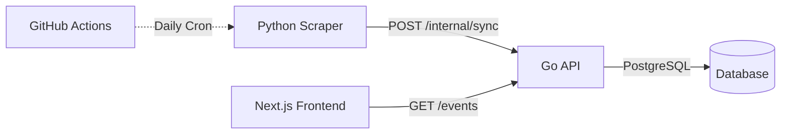

# Runners List Scraper

> **Python web scraper for Malaysian running events aggregation platform**

Part of the **Runners List Platform** - a microservices-ready architecture for scraping, storing, and serving running event data across Malaysia.

[](https://python.org)
[](https://www.selenium.dev)
[](./tests)

---

## Table of Contents

- [Overview](#overview)
- [The Holy Trinity](#the-holy-trinity)
- [Architecture](#architecture)
- [Quick Start](#quick-start)
- [Configuration](#configuration)
- [Development](#development)
- [Testing](#testing)

---

## Overview

The **Runners List Scraper** extracts running event data from Malaysian event listing websites and syncs it to the Go API. It uses Selenium for JavaScript rendering and BeautifulSoup for HTML parsing.

### The Holy Trinity

This scraper is part of a **microservices-ready architecture** consisting of three core services:



#### 1. **Python Scraper** (This Repository)
- **Purpose**: Extracts running event data from Malaysian event listing websites
- **Tech**: Python, Selenium, BeautifulSoup4, Requests
- **Features**:
  - Scrapes event name, date, location, state, distance
  - Automated retry logic with exponential backoff
  - Sends data to API via secure internal endpoint
  - Comprehensive validation and reporting

#### 2. **Go API**
- **Repository**: [runners-list-api](../api)
- **Purpose**: Central data hub with RESTful API for event management
- **Tech**: Go, Fiber v2, GORM, PostgreSQL

#### 3. **Next.js Frontend**
- **Repository**: [runners-list-web](../web)
- **Purpose**: User-facing web application for browsing events
- **Tech**: Next.js 15, React 18, TypeScript, Tailwind CSS

---

## Architecture

### Modular Structure

```
scraper/
├── src/
│   ├── __init__.py
│   ├── config.py              # Configuration & constants
│   ├── models.py              # Event dataclass
│   ├── main.py                # CLI entry point
│   ├── services/
│   │   ├── browser.py         # Selenium WebDriver
│   │   ├── parser.py          # HTML extraction
│   │   ├── api_client.py      # API sync with retry
│   │   └── file_exporter.py   # JSON/CSV export
│   └── utils/
│       └── validators.py      # Validation functions
├── tests/
│   ├── conftest.py            # Pytest fixtures
│   └── test_scraper.py        # Test suite (58 tests)
├── requirements.txt
├── pytest.ini
├── .env.example
└── README.md
```

### Data Model

```python
@dataclass
class Event:
    name: str              # Event name
    location: str          # City, State
    state: str             # Malaysian state (extracted)
    distance: str          # Race distance (extracted)
    date: str              # YYYY-MM-DD format
    description: str       # Optional description
    registration_url: str  # Registration link
```

---

## Quick Start

### Prerequisites
- Python 3.12+
- Chrome/Chromium (for Selenium)
- ChromeDriver

### 1. Set Up Environment
```bash
cd scraper

# Create virtual environment
python3 -m venv venv
source venv/bin/activate  # On Windows: venv\Scripts\activate

# Install dependencies
pip install -r requirements.txt
```

### 2. Configure Environment Variables
```bash
cp .env.example .env
# Edit .env with your configuration
```

### 3. Run the Scraper
```bash
python -m src.main
```

### 4. Sample Output
```
Fetching events from: https://pm1.blogspot.com/p/running-event-2026.html
Extracting event data...
Validating events...

✓ Scraping completed
Total events extracted: 138
Data saved to events.json and events.csv

==================================================
 Dataset Validation Report
==================================================
✓ Total events: 138
✓ Date range: 2026-01-01 to 2026-11-08
✓ Events with states: 94 (68.1%)
✓ Events with distances: 51 (37.0%)
==================================================
```

---

## Configuration

### Environment Variables

| Variable | Required | Description |
|----------|----------|-------------|
| `SCRAPE_URL` | ✅ Yes | URL to scrape running events from |
| `API_URL` | For sync | URL of the Go API internal sync endpoint |
| `API_KEY` | For sync | Internal API key (must match API's `INTERNAL_API_KEY`) |

### Example `.env`
```env
# Scraping Configuration
SCRAPE_URL=https://pm1.blogspot.com/p/running-event-2026.html

# API Configuration (for syncing)
API_URL=http://localhost:8080/api/v1/internal/sync
API_KEY=your_internal_api_key_here
```

### CLI Arguments

```bash
python -m src.main --help

Options:
  --url URL       Override SCRAPE_URL from environment
  --output DIR    Output directory for JSON/CSV files (default: .)
  --no-api        Skip API sync even if credentials are set
  -v, --verbose   Enable verbose logging
```

---

## Development

### Project Structure

| Module | Responsibility |
|--------|----------------|
| `config.py` | Constants, logging, env var loading |
| `models.py` | Event dataclass with serialization |
| `browser.py` | WebDriver setup, page fetching |
| `parser.py` | HTML parsing, event extraction |
| `validators.py` | URL/date/event/dataset validation |
| `api_client.py` | API sync with retry logic |
| `file_exporter.py` | JSON/CSV file output |
| `main.py` | CLI entry point, orchestration |

### Extraction Patterns

**State Extraction** (from location):
- `"Kota Belud, Sabah"` → `"Sabah"`
- `"KLCC, Kuala Lumpur"` → `"Kuala Lumpur"`

**Distance Extraction** (from event name):
- `"Half Marathon"`, `"HM"` → `"21km"`
- `"Marathon"`, `"42KM"` → `"42km"`
- `"Ultra"` → `"50km+"`
- `"5K"`, `"10K"` → `"5km"`, `"10km"`

---

## Testing

### Run All Tests
```bash
python -m pytest tests/ -v
```

### Run with Coverage
```bash
python -m pytest tests/ --cov=src --cov-report=html
```

View coverage report: `open htmlcov/index.html`

### Test Statistics

- **Total Tests**: 58
- **Pass Rate**: 100%

---

## Docker

### Run with Docker Compose (from monorepo root)

```bash
# Start API and database
docker compose up -d postgres api

# Run scraper
docker compose run --rm scraper python -m src.main
```

---

## License

MIT

---

**Part of the Runners List Platform** | [Scraper](.) | [API](../api) | [Frontend](../web)
